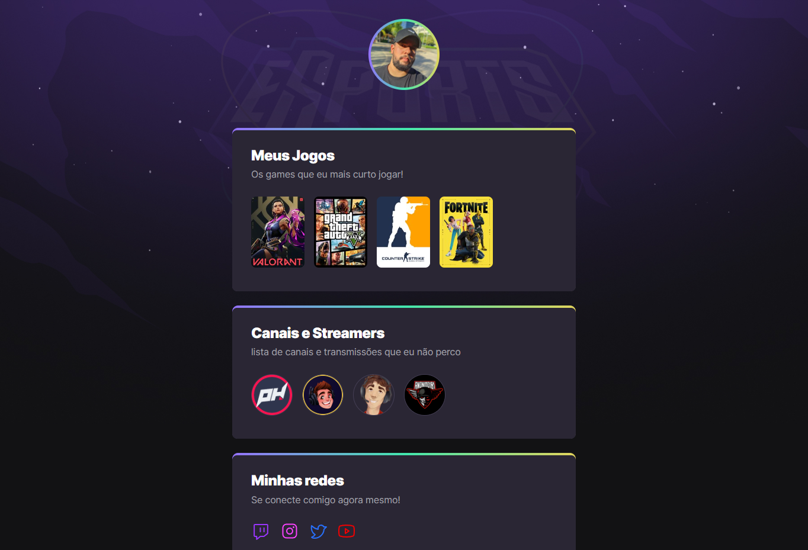

<h1 align="center">
    
</h1>

  <a href="#-technologies">Technologies</a>&nbsp;&nbsp;&nbsp;|&nbsp;&nbsp;&nbsp;
  <a href="#-project">Project</a>&nbsp;&nbsp;&nbsp;|&nbsp;&nbsp;&nbsp;
  <a href="#-starting">Starting</a>

 

### Web Version

## 🚀 Starting

To start the project, just open the file `index.html` in your preferred browser, or [Click on this link to enter the site](https://julioalvesrj.github.io/NLW/)

## 🧪 Technologies

This project was developed using the following technologies:

- [HTML](https://#)
- [CSS](https://#)
- [GIT](https://#)
- [GITHUB](https://#)

## 💻 Project

Project has been created during the event Next Level Week by @rocketseat

---

Coded by Júlio Alves
